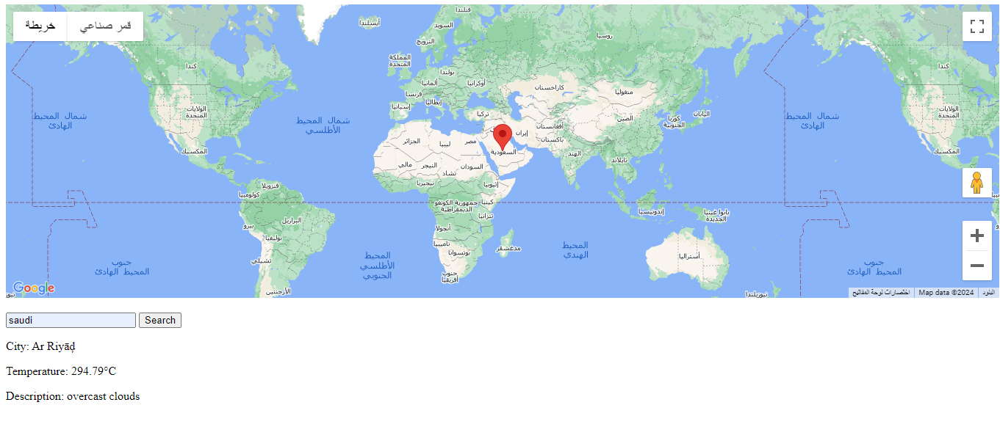

Weather API
The Weather API is a RESTful API built with Node.js and Express.js for retrieving weather information for cities. It provides endpoints for fetching weather data for individual cities, statistics for weather data, bulk weather data retrieval, and mapping cities with their weather data.

Table of Contents
Introduction
Installation
Usage
Endpoints
Contributing
License
Introduction
The Weather API allows developers to access current weather data for various cities. It is designed to be simple to use and integrates caching to improve performance and reduce API requests. The API utilizes the WeatherAPI.com service to fetch weather information.

Installation
To install and run the Weather API locally, follow these steps:

Clone the repository:

bash
Copy code
git clone <repository_url>
Navigate to the project directory:

bash
Copy code
cd weather-api
Install dependencies:

bash
Copy code
npm install
Set up environment variables:

Create a .env file in the root directory and add the following:

plaintext
Copy code
WEATHER_API_KEY=your_weather_api_key_here
Replace your_weather_api_key_here with your actual WeatherAPI.com API key.

Start the server:

bash
Copy code
for http 
cd http && node index.js 
for websocket run both files  
cd websocket-question &&
node websocket_client.js && node websocket.js
The API server will start running on port 3000 by default.

Usage
The Weather API provides several endpoints for retrieving weather data:

/weather/city/:city: Retrieve weather data for a specific city.
/weather/bulk: Retrieve weather data for multiple cities in bulk.
/statistics: Get statistics for weather data.
/map: Access map-related functionality to view weather data for cities. 

For detailed usage instructions and examples, refer to the Endpoints section below.

Endpoints
The Weather API exposes the following endpoints:

/weather/city/:city: Fetch weather data for a specific city.
/weather/bulk: Fetch weather data for multiple cities in bulk.
/statistics: Get statistics for weather data.
/map: Access map-related functionality to view weather data for cities.
/live: Websocket endpoint for live weather data updates.
For detailed information on each endpoint, including request parameters and response formats, please refer to the corresponding route files in the repository.

Contributing
Contributions to the Weather API project are welcome! To contribute, follow these steps:

Fork the repository.
Create a new branch for your feature or bug fix.
Make your changes and commit them.
Push your changes to your fork.
Submit a pull request.
License
The Weather API is licensed under the MIT License. See the LICENSE file for more information.